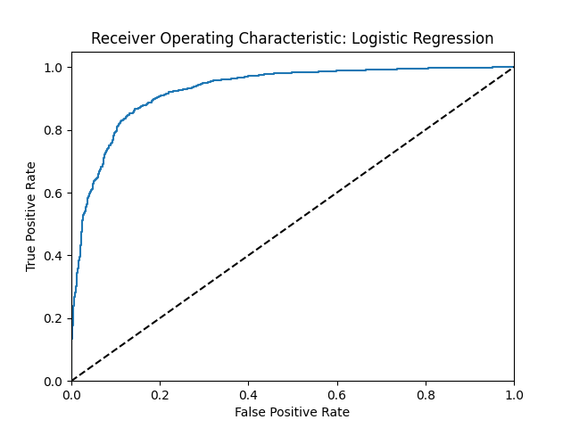
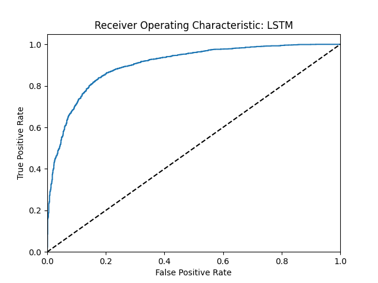
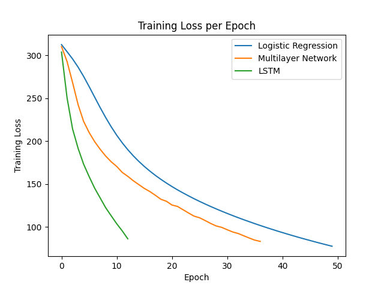
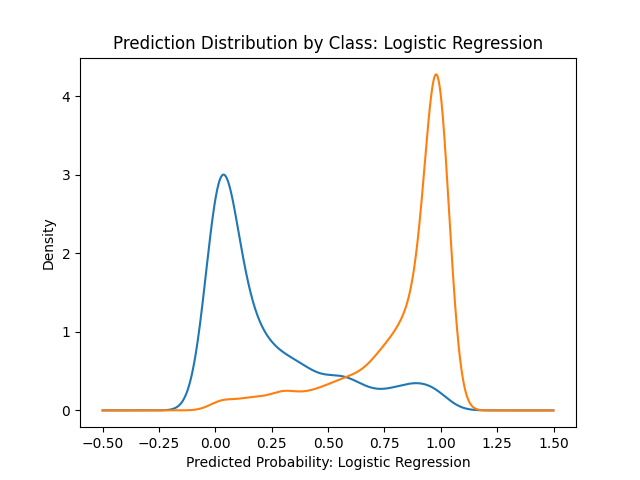
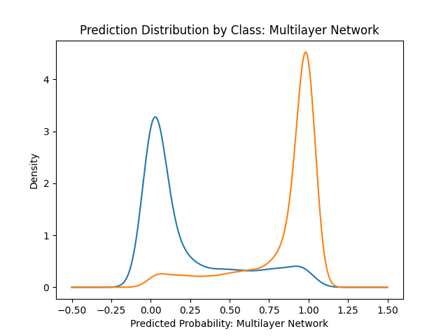
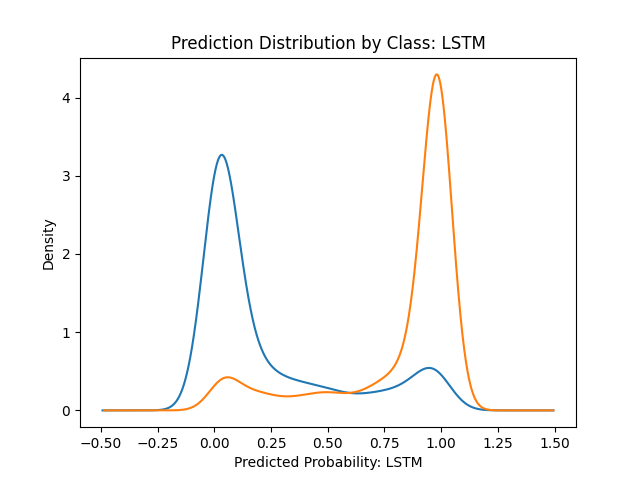

# Sentiment Classification

The training script in this repository is designed to train and evaluate two model types on the binary sentiment classification of Amazon product reviews. All experiments are designed to run on the GPU using PyTorch, and follow a reproducible pipeline. The pre-processing pipeline includes: lowercasing and punctuation removal, tokenisation using whitespace splitting, stopword removal, encoding tokens as integer indices, and padding sequences to a fixed length of 256 tokens. The data is split 80% training, 10% validation and 10% test. Training is run for 50 epochs with early stopping based on the validation loss.

The two primary models compared are Logistic Regression and a Long Short-Term Memory (LSTM) network. A multilayer network is also included for reference as an intermediate comparison.

## Model 1 - Logistic Regression
Whilst a traditional logistic regression model would typically operate on a one-hot encoding of the input data, this model instead starts with an embedding layer. This design is to ensure that any performance difference with the second model (an LSTM, which also uses an embedding layer) relates as much as possible to the model architecture rather than how the input data is represented. Effectively, the model is applying logistic regression over the averaged word embeddings of a sequence. The components of the model are as follows:
- Converts tokens in a sequence to a vector representation of embeddings, mapped from each token index, with an embedding dimension of 128.
- Uses a padding_idx of 0 so that the 0's appended to sequences shorter than the MAX_SEQ_LENGTH of 256 are initialised to zeros in the embedding and not updated during training. A padding mask is created and used to zero out these padding embeddings to prevent them from influencing the averaged sequence representation.
- The mean average of the masked embeddings across a sequence is taken, producing a single fixed-size vector per example. This approach has its weaknesses in that word order and token interactions are ignored.
- A linear transformation layer is applied to the averaged embedding, outputting a single logit per example.
- For binary classification, the model outputs a probability between 0 and 1 by passing the logit through a sigmoid function.

## Model 2 - Long Short-Term Memory (LSTM)
To capture the sequential nature of the input, this model extends the approach of logistic regression by including two LSTM layers. An LSTM is a type of recurrent neural network (RNN) that can retain information over long sequences. It extends the RNN architecture by adding a forget gate to remove information no longer needed as context, an add gate to select new information to add to the context, and an output gate to decide the information for the current hidden state (Jurafsky & Martin, 2026). This creates a form of memory cell that can be used in training. The components of the model are as follows:
- As with the first model, each token index in a sequence is mapped to an embedding vector.
- The padding_idx of 0 is also used to ensure that padded tokens do not contribute to the embeddings.
- This model uses the torch utility packed_padded_sequence to handle variable length sequences by ignoring padding.
- A two-layer LSTM with hidden dimension 64 processes the packed embeddings. Dropout of 0.1 is applied between the LSTM layers to reduce overfitting. The final hidden state is used as a summary representation of the sequence.
- For additional regularisation, dropout of 0.2 is applied to the final hidden state before passing it through a linear transformation layer that outputs a single logit per example.
- For binary classification, the model outputs a probability between 0 and 1 by passing the logit through a sigmoid function.

### Area Under the Curve (AUC) Scores indicate Logistic Regression outperforms LSTM

1. Logistic Regression AUC = 0.927
2. LSTM AUC = 0.902

The higher AUC value for Logistic Regression demonstrates that this model is likely more effective than the LSTM at classifying positive and negative reviews, given the same data representation. Using bootstrapping on the AUC values further supports evidence of this performance gap as the average AUC and 95% confidence intervals suggest a consistent difference: Logistic Regression Bootstrapped AUC and 95% confidence interval (mean 0.927, lower 0.919, upper 0.936), LSTM Bootstraped AUC and 95% confidence interval (mean 0.902, lower 0.891, upper 0.912).

Macro-averaged F1 scores also indicate stronger Logistic Regression performance: Logistic Regression (0.857), and LSTM (0.829).

### Bootstrapped p-value confirms Logistic Regression AUC is significantly higher than for the LSTM

To test whether the AUC for the Logistic Regression model is significantly higher than the AUC for the LSTM model, bootstrapping is also used to estimate a p-value. The bootstrap_p_value function repeatedly resamples the test data with replacement and computes the difference in AUC between the two models (LSTM minus Logistic Regression). The p-value is then calculated as the proportion of bootstrap samples where this difference is less than or equal to zero (i.e. where the LSTM does not outperform Logistic Regression). In this case, a p-value > 0.95 would indicate that it is unlikely for the Logistic Regression model to perform no better than the LSTM by chance.

The computed p-value is 1.0, providing strong evidence that Logistic Regression achieves a significantly higher AUC than the LSTM. This is despite the LSTM having increased model capacity and the ability to capture the sequential nature of language. This most likely reflects the suitability of the input representation to Logistic Regression. The LSTM is likely disadvantaged by the removal of stopwords, the capped sequence length, and the use of the same learning rate and early stopping mechanism (the LSTM loss curve indicates the model converged early or stopped prematurely). Whilst increasing LSTM model complexity (e.g. bidirectionality, attention) could improve performance, preprocessing and training configuration would be a more immediate prerequisite. Overall, these results indicate that sentiment classification is driven by the presence of certain words rather than their order, and that increased model capacity alone does not guarantee improved performance.

### ROC curves

Receiver Operating Characteristic curves further demonstrate the effectiveness of Logistic Regression performance, with a curve that reaches further into the top-left corner of the plot:

### Additional analysis

The training script also trains and evaluates a multilayer network that uses the same embedding dimension, hidden dimension, number of layers and similar dropout strategy as the LSTM. This is only included as a useful intermediate reference to help understand the different in performance of a recurrent network, a simple network, and logistic regression. In summary, the multilayer network sits firmly between Logistic Regression and the LSTM when it comes to the steepness of the training loss curve, F1 scores, and prediction distribution by class (density plots).

F1 test set scores: Logistic Regression (0.857), Multilayer Network (0.841), LSTM (0.829).

### Repository files
- training.py - the script for training and evaluation
- slurm_script.slurm - the script for running training.py on the Computational Shared Facility
- results.csv - the CSV file containing all evaluation metrics
- plots of the training loss, density plots for each model, and roc curves for each model
- slurm-13374611.out - the output file from running sbatch slurm_script.slurm on the Computational Shared Facility
